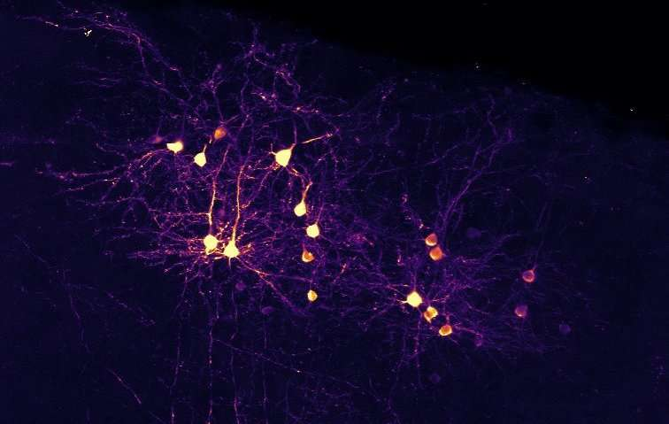

# Assignment 1 - Collocation
[GITHUB LINK](https://github.com/Rysias/cds-assignments/tree/main/language-assignments/language-a1)


*source: Google Images*


["Neurons that fire together, wire together"](https://neurosciencenews.com/wire-fire-neurons-19835/). Such goes a famous saying by Donald Hebb. However, the powers of joint activity goes beyond neuroscience - it can also be used in studying text! 

In this assignment we will build a tool that does collocation, that is figuring out what words appear in the same context. This can be a useful tool for doing distant reading and analysing stylistic differences in authors. 

## Table of Content 
- [Assignment Description](#assignment-description)
    * [Personal learning goals](#personal-learning-goals)
- [Methods and design](#methods-and-design)
    * [Software design](#software-design)
- [Usage](#usage)
    * [Setting up](#setting-up)
    * [Using the script(s)](#using-the-scripts)
- [Results and Discussion](#results-and-discussion)
    * [Results](#results)
    * [Discussion](#discussion)

## Assignment Description
For this assignment, you will write a small Python program to perform collocational analysis using the string processing and NLP tools you've already encountered. Your script should do the following:

- Take a user-defined search term and a user-defined window size.
- Take one specific text which the user can define.
- Find all the context words which appear ± the window size from the search term in that text.
- Calculate the mutual information score for each context word.
- Save the results as a CSV file with (at least) the following columns: the collocate term; how often it appears as a collocate; how often it appears in the text; the mutual information score.

**Additional bonus tasks completed**
- Create a program which does the above for every novel in the corpus, saving one output CSV per novel
- Create a program which does this for the whole dataset, creating a CSV with one set of results, showing the mutual information scores for collocates across the whole set of texts
- Create a program which allows a user to define a number of different collocates at the same time, rather than only one

### Personal Learning Goals
Apart from challenging myself with the bonus tasks, I want to see if I can make the assignment follow the  [SOLID principles](https://www.digitalocean.com/community/conceptual_articles/s-o-l-i-d-the-first-five-principles-of-object-oriented-design) to the extent that it makes sense. There is a lot of room for this, as many of the tasks follow the same basic structure. I will explain more about this in the [software design section](#software-design). 

## Methods and Design
There a several steps in creating a collocation pipeline. The first is to tokenize the document, that is to split the document into words (tokens). This seems like a trivial task - why not just split by spaces and call it a day. But language is difficult (and English particularly so). Punctuation and weird grammatical rules produce a plethora of edge cases. I will therefore rely on the wizards of [SpaCy](spacy.io) - a magnificent software package for doing production-grade NLP. 

The only main preprocessing I do is to remove punctuation and lower-case all words. 

The next is to find all the collocates, that is finding all words within a user-specified window of the source word. To speed up the computations (which was necessary as discussed [later](#performance-testing)) I use pandas and numpy for vectorization.

When all these collocates have been found and organised in a dataframe, the final step is to calculate the mutual information score. Informally, mutual information is a measure of how much information about A (say the source word) the presence of B (the collocate) gives you. More formally, I use the formula used by [English Corpora](https://www.english-corpora.org/mutualInformation.asp), which goes as follows: 

```
MI = log ( (AB * sizeCorpus) / (A * B * span) ) / log (2)
```

With A being frequency of node word, B being the frequency of the collocate, and AB being their joint frequency. 

### Software Design
As all the scripts share much of the same machinery, there are ample opportunity to keep the code [DRY](https://en.wikipedia.org/wiki/Don%27t_repeat_yourself) and [SOLID](https://www.digitalocean.com/community/conceptual_articles/s-o-l-i-d-the-first-five-principles-of-object-oriented-design). Below I describe how each of the SOLID principles apply to my code.

- **Single responsibility**: Each function does one thing and one thing only, which makes them a) easier to debug and b) easier to refactor.On a higher level, I have also split the parts (tokenization and collocation) into different files ([`src/tokenize.py`](./src/tokenize.py) and [`src/collocate.py`](./src/collocate.py)) which further increases cohesion while lowering coupling.
- **Open-closed**: By splitting the tokenization into a separate file, I make it easier to switch the backend to another framework such as [NLTK](https://www.nltk.org/). 
- **Liskov substitution**: Not applicable as we don't work with classes. 
- **Interface segregation**: I segregate interfaces on two levels.
    1. Each script (e.g. [`collocate_single_txt.py`](./collocate_single_text.py)) has minimal dependencies, which lowers coupling. 
    2. By splitting functionality as described earlier, I make testing and changing files less dependent on external dependencies.
- **Dependency Inversion**: Not super relevant for this project, as the assignment is relatively set so we don't need to juggle different back-ends. However, following the other principles makes this relatively easy to implement.

## Usage 
TL;DR: An example of the entire setup and running the pipeline can be run using the bash-script `run_project.sh`. 

### Setting up
The project uses [pipenv](https://pipenv-fork.readthedocs.io/en/latest/basics.html). Setup can be done as easily as `pipenv install` (after pipenv has been installed) and activating the environment is `pipenv shell`. NB: Make sure that you have python 3.9 (or later) installed on your system!

### Using the scripts 
All the scripts are documented using argparse. instructions can therefore be found using the `--help` flag (e.g. `python collocate_single_test.py --help`). However, as there are quite a few scripts, below is a little table with descriptions: 


Script Name | Supported | Solves 
---- | ---- | ---- 
[`collocate_single_text.py`](./collocate_single_text.py) | :heavy_check_mark: | Collocation of a given word in a single file (main task) 
[`collocate_corpus.py`](./collocate_corpus.py) | :heavy_check_mark: | Collocation of a word in an entire corpus (outputs a single file)
[`collocate_multi_words.py`](./collocate_corpus.py) | :heavy_check_mark: | Collocation of multiple words in a text
[`collocate_all_texts.py`](./collocate_all_texts.py) | :heavy_check_mark: | Runs collocation on all texts in a directory (outputs one .csv per file)
[`plot_bleak.py`](./collocate_all_texts.py) | :heavy_check_mark: | Creates a nice plot of the output of our test.

#### Example usage
```console
python collocate_single_text.py --file-name "Dickens_Bleak_1853.txt" --search-term "bleak" --window-size 6
```

## Discussion
### Performance testing
Early in my process, I discovered that collocation is a compute-intensive task. As I was writing a script that handled _all 100 texts_ in the dataset I was spending most of my time waiting. To remedy this I employed performance testing to boost the performance. I used cProfile - a great command-line tool that generates detailed performance reports. You can see the script used [here](./profile_collocate.sh) and the output directory is [`/performance`](./performance/). 

The tool was immensively helpful in shaving down the run-time. One of the main benefits was removing expensive for-loops when finding the collocates. Instead of was able to run the pipeline in pure pandas which is much faster (link). 

If we look at the latest [`profile.txt`](./performance/profile.txt) it is apparent that most of the time is spent on tokenizing the text. This is currently done through SpaCy, which is quite performant. It is feasible that we could spend some time developing a super-fast tokenizer specialized to collocation but I am quite satisfied with the performance. 

### Collocation results
Now that we have created a performant pipeline, it is time to look at what sorts of insights can be gleamed from collocation. Below, I have created a plot of the highest MI collocates of the word "Bleak" in the Charles Dickins classic "Bleak House". 

*figure 1: Bleak House collocates*

When creating this plot it quickly become apparent that it was important to remove words that only appear once as they might score artificially highly on MI. For example, the top locates in [the file](./output/Dickens_Bleak_1853_bleak.csv) are "Charles" and "Dickens", which is not relevant for the plot. 

But once that is done, the plot provides an interesting view into the book. (Disclaimer: I haven't read the book (yet!) so the plot also provides my first view). The word "thinning" is particularly interesting. From a quick google search it seems to be present in an interaction between the narrator and a guard in [chapter 52](http://www.literaturepage.com/read/dickens-bleak-house-802.html). Here the guard says the phrase "Bleak House is thinning fast" twice. This phrase takes up a lot of space in the plot as all words (except "is") appear in top five. 

While this finding probably won't revolutionize the field of English Litterature, it did lead me to a key part of the book in a quite organic way. Collocation seems to be a useful tool for [distant reading](https://books.google.dk/books/about/Distant_Reading.html?id=Sh9uNQEACAAJ&redir_esc=y) the classics (if one has access to txt files and python but not [CliffsNotes](https://www.cliffsnotes.com/)!)


