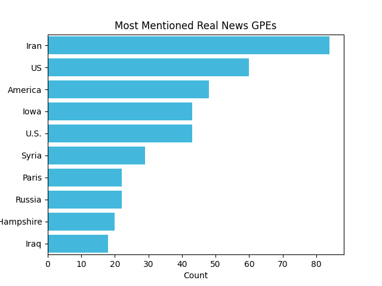

# Assignment 3 - Transfer learning + CNN classification
[GITHUB LINK](https://github.com/Rysias/cds-assignments/tree/main/language-assignments/language-a2)

# TODO: Abstract

## Table of Content
- [Assignment Description](#assignment-description)
    * [Personal learning goals](#personal-learning-goals)
- [Methods and design](#methods-and-design)
    * [Software design](#software-design)
- [Usage](#usage)
    * [Setting up](#setting-up)
    * [Using the script(s)](#using-the-scripts)
- [Results and Discussion](#results-and-discussion)
    * [Results](#results)
    * [Discussion](#discussion)

## Assignment Description
I have chosen subtask 2 for this assignment: 

2. Using the corpus of Fake vs Real news, write some code which does the following
   - Split the data into two datasets - one of Fake news and one of Real news
   - For every headline
     - Get the sentiment scores
     - Find all mentions of geopolitical entites
     - Save a CSV which shows the text ID, the sentiment scores, and column showing all GPEs in that text
   - Find the 20 most common geopolitical entities mentioned across each dataset - plot the results as a bar charts

**Bonus tasks completed**
- Repeat experiments using both sentiment analysis techniques, in order to compare results.

### Personal Learning Goals
# TODO: Create this!

## Methods and Design
The overall approach to this task is quite similar to [assignment 2](../vision-a2/) with a few different notes. the main difference is that we use a much more powerful system in relying on vgg16 as our base model.

Other than that the flow goes as follows (as shown in [transfer_cnn.py](./transfer_cnn.py)): 
1. specify the hyperparameters using the command line
2. load the data 
3. initialize the model
4. train the model
5. evaluate (both in terms of the training plot and the classification report)

### Software Design (TODO THIS)
- **Single responsibility**: 
- **Open-closed**: 
- **Liskov substitution**: 
- **Interface segregation**: 
- **Dependency Inversion**: 

## Usage 
TL;DR: An example of the entire setup and running the pipeline can be run using the bash-script `run_project.sh`. 

### Setting up
The project uses [pipenv](https://pipenv-fork.readthedocs.io/en/latest/basics.html). Setup can be done as easily as `pipenv install` (after pipenv has been installed) and activating the environment is `pipenv shell`. NB: Make sure that you have python 3.9 (or later) installed on your system!

### Using the script (TODO THIS)

Parameter | Type | Required | Description
---- | ---- | ---- | ----
`--learning-rate` | `float` | No | The learning rate (defaults to 0.001)
`--learning-rate` | `int` | No | Batch size for each iteration of SGD (defaults to 32)
`--epochs` | `int` | No | How many epochs to train for (defaults to 10).

#### Example usage
```console
$ python TODO
```
## Discussion and results
### Geopolitical Entities
The first thing we will investigate is the performance of the NER pipeline. The output can be seen in the table below: 

Fake News GPEs             |  Real News GPEs
:-------------------------:|:-------------------------:
|  

*figure 1: Mentions of geopolitcal entities*

The first thing to notice is that the performance is generally good. Most of the entries are in fact geopolitical entities. There are only two mistakes. One is that US and U.S. should be only one entity. This could be remedied by adding Named Entity Disambiguation (LINK) to the pipeline. In this simple instance it could probably be solved with a rule-based approach. For a more scalable (but also complex) solution, the [current SOTA](https://paperswithcode.com/paper/pre-training-of-deep-contextualized) seems to be using embeddings from large language models. In this case however, it would be shooting sparrows with cannons as the non-English idiom goes.

The other issue is that "Kasich" is recognised as a Geopolitical Entity, although it probably refers to the former senator from Ohio (LINK). This is, however, a difficult mistake, as he has buildings named after him such as the Kasic Hall (LINK). He is therefore in an abstract sense a political entity that is related to geography, which is fairly confusing for algorithms and people alike!

These relatively minor mistakes highlights how powerful the modern open source data science ecosystem is. It allows students like us to stand on the shoulders of giants (like SpaCy) and create awesome insights without the trouble of training giant models. 

For example the following insights can be gleamed from the plots.  

* **Real News are more domestically focused while fake news seem more international**: Most of the entities in the Real news dataset are US states, whereas there are many countries in the fake news dataset. 
* **The dataset seems primarily concerned with the US**: This is not at all surprising but nevertheless important for the types of analysis one can make.
* **Iran vs Russia**: There is pretty strong difference in focus of the two top entities in the respective cohorts. This might indicate that fake news are more focus on general narratives and real news more focused on current events. 

While the above insights are interesting one should treat them as paths of exploration rather than scientifically solid findings. However, that is an essential first step for doing great science!

### Sentiment
Now let's turn to a quick look at the two sentiment analysis algorithms: 


The first thing to note is the different scale. Vader has negative values while textblob is positive. To some extent this is expected: TextBlob has scores that range from [-1, 1] whereas Vader 

# TODO: INVESTIGATE THIS


 

## TODO
- [ ] Split textblob and spacy into separate files