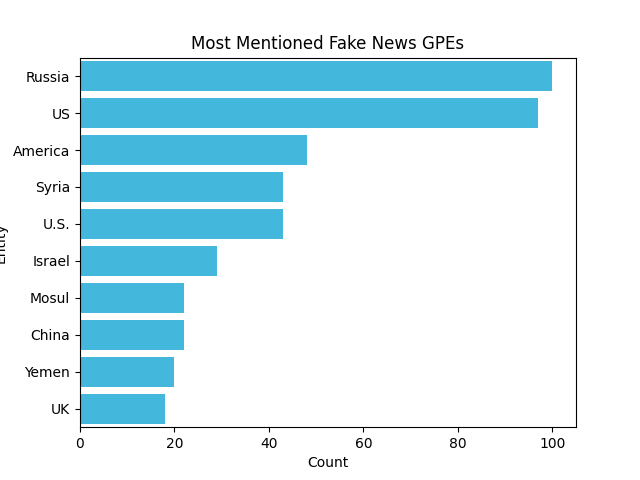
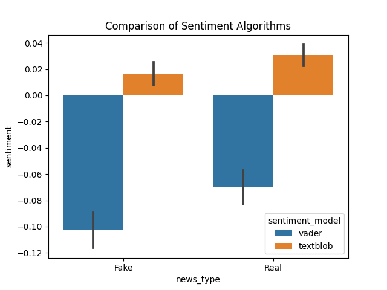

# Language Assignment 2 - Sentiment and NER
[GITHUB LINK](https://github.com/Rysias/cds-assignments/tree/main/language-assignments/language-a2)

# TODO 
- Move beyond simple counting --> use great software 
- Why is sentiment and NER useful? 
- Why does leveraging libraries rock?

## Table of Content
- [Assignment Description](#assignment-description)
    * [Personal learning goals](#personal-learning-goals)
- [Methods and design](#methods-and-design)
    * [Software design](#software-design)
- [Usage](#usage)
    * [Setting up](#setting-up)
    * [Using the script(s)](#using-the-scripts)
- [Results and Discussion](#results-and-discussion)
    * [Results](#results)
    * [Discussion](#discussion)

## Assignment Description
I have chosen subtask 2 for this assignment: 

2. Using the corpus of Fake vs Real news, write some code which does the following
   - Split the data into two datasets - one of Fake news and one of Real news
   - For every headline
     - Get the sentiment scores
     - Find all mentions of geopolitical entites
     - Save a CSV which shows the text ID, the sentiment scores, and column showing all GPEs in that text
   - Find the 20 most common geopolitical entities mentioned across each dataset - plot the results as a bar charts

**Bonus tasks completed**
- Repeat experiments using both sentiment analysis techniques, in order to compare results.

### Personal Learning Goals
There are quite a few components in this task. I therefore want to try to follow the SOLID principles to see if I can write some production-quality code! I also want to try experimenting with test-driven development as it is a great methodology for writing good code but quite difficult in a data science context.

## Methods and Design
### Methods
The main idea is to utilize the magic of SpaCy (LINK) - a powerful production-ready NLP library with performant and easy to implement algorithms. We utilise its in-build Named Entity Recognition which allow us to recognise Geopolitical Entities (GPE) out-of-the-box. 

For sentiment analysis we use two classical sentiment analysis algorithms: TextBlob and VADER. Both rely on dictionary-based approaches albeit with slight differences. While VADER uses a simple word-list and some rudimentary rules, TextBlob is build on WordNet (LINK) - an English ontology with rich linguistic information. However, TextBlob also only works on adjectives which might be a limiting factor. 

On the whole, both algorithms are quite dated. The new state-of-the-art (SOTA) uses deep learning to include contextual information not captured in simple words.

### Software Design
This project lends itself particularly well to the SOLID principles as it has different components (entity extraction and sentiment analysis) that should ideally work independently of each other. Furthermore, it might be nice to have the option of extending the framework to include more sentiment analysis algorithms. 

That being said, I have chosen to rely on [SpaCy](LINK HERE) which introduces some coupling. However, the stability and performance of SpaCy makes this tradeoff wortwhile. 

Below is a summary of how each principle applies. 

- **Single responsibility**: Each component of the pipeline is split out into a separate file (e.g. [`src/geopol.py`](./src/geopol.py) is separate from the [`src/plot_geopol.py`](./src/plot_geopol.py). This makes it easier to localise errors and fix dependencies.
- **Open-closed**: As each sentiment analysis algorithm has a separate file ([`src/textblob.py](./src/textblob.py) and [`src/vader.py`](./src/vader.py)) and follows a similar input-output structure it makes it easy to add a new algorithm
- **Liskov substitution**: Not applicable as there is no inheritance going on.
- **Interface segregation**: By having separate files, we minimize the amounts of external dependencies in the main script ([`process_news.py`](./process_news.py)) to be only Pandas and Spacy.
- **Dependency Inversion**: By using the fact that functions are first class citizens in python (LINK) and structural typing, we make it easier to choose between different sentiment analysis algorithms. 

All of this is verified by software tests as this project is developed using a TDD approach (LINK). 

## Usage 
TL;DR: An example of the entire setup and running the pipeline can be run using the bash-script `run_project.sh`. 

### Setting up
The project uses [pipenv](https://pipenv-fork.readthedocs.io/en/latest/basics.html). Setup can be done as easily as `pipenv install` (after pipenv has been installed) and activating the environment is `pipenv shell`. NB: Make sure that you have python 3.9 (or later) installed on your system!

### Using the script
There are two scripts in this repository: [`process_news.py`](./process_news.py) (the main script) and [`plot_sentiments.py`](./plot_sentiments.py) (helper script for [comparing the sentiments](#sentiment)). Only `process_news.py` has any real optionality as the other is run automagically as part of `run_project.sh`. I will therefore focus this usage guide on `process_news.py`. 

The script is documented using argparse. Usage information can therefore be found using `python process_news.py --help`. Running that command will give the following output: 

```{console}
usage: process_news.py [-h] [--sentiment {textblob,vader}] [--top-n TOP_N] [--data-path DATA_PATH]

Finds Geopolitical entities (GEOP) and their sentiment from news headlines from a dataset containing fake and real news. Also plots the top n (default 20)    
most mentioned entities

optional arguments:
  -h, --help            show this help message and exit
  --sentiment {textblob,vader}
                        Sentiment model to use (default: textblob)
  --top-n TOP_N         Number of entities to plot (default: 20)
  --data-path DATA_PATH
                        Path to the fake_or_real_news.csv file
```

### **Example usage**
```bash
$ python process_news.py --sentiment vader --top-n 30
```

## Testing
The scripts were developed using a TDD-methodology using [pytest](https://docs.pytest.org/en/7.0.x/). To execute the test suite run `python -m pytest` from the main directory (`language-a2`)

## Discussion and results
### Geopolitical Entities
The first thing we will investigate is the performance of the NER pipeline. The output can be seen in the table below: 

Fake News GPEs             |  Real News GPEs
:-------------------------:|:-------------------------:
|  

*figure 1: Mentions of geopolitcal entities*

The first thing to notice is that the performance is generally good. Most of the entries are in fact geopolitical entities. There are only two mistakes. One is that US and U.S. should be only one entity. This could be remedied by adding Named Entity Disambiguation (LINK) to the pipeline. In this simple instance it could probably be solved with a rule-based approach. For a more scalable (but also complex) solution, the [current SOTA](https://paperswithcode.com/paper/pre-training-of-deep-contextualized) seems to be using embeddings from large language models. In this case however, it would be shooting sparrows with cannons as the non-English idiom goes.

The other issue is that "Kasich" is recognised as a Geopolitical Entity, although it probably refers to the former senator from Ohio (LINK). This is, however, a difficult mistake, as he has buildings named after him such as the Kasic Hall (LINK). He is therefore in an abstract sense a political entity that is related to geography, which is fairly confusing for algorithms and people alike!

These relatively minor mistakes highlights how powerful the modern open source data science ecosystem is. It allows students like us to stand on the shoulders of giants (like SpaCy) and create awesome insights without the trouble of training giant models. 

For example the following insights can be gleamed from the plots.  

* **Real News are more domestically focused while fake news seem more international**: Most of the entities in the Real news dataset are US states, whereas there are many countries in the fake news dataset. 
* **The dataset seems primarily concerned with the US**: This is not at all surprising but nevertheless important for the types of analysis one can make.
* **Iran vs Russia**: There is pretty strong difference in focus of the two top entities in the respective cohorts. This might indicate that fake news are more focus on general narratives and real news more focused on current events. 

While the above insights are interesting one should treat them as paths of exploration rather than scientifically solid findings. However, that is an essential first step for doing great science!

### Sentiment
Now let's turn to a quick look at the two sentiment analysis algorithms: 



The first thing to note is the different scale. Vader has negative values while textblob is positive. To some extent this is expected: spacytextblob has scores that range from [-1, 1] whereas Vader has scores in the range [-5, 5]. To do a formal statistical comparison one woudl therefore have to normalise both. This is however beyond this assignment. 

Taking the scale (informally) into account, one can see that both algorithms agree on the broad tendency: fake news are generally more negative than real news. This seems intuitively right as negativity is generally more attention grabbing (CITATION). As fake news has the primary goal of engaging the reader, they have more emotional keys to play on. This stands in contrast to real news who also have to inform. 

## Todo
- [ ] Run code to check if it works 
- [ ] Run tests

