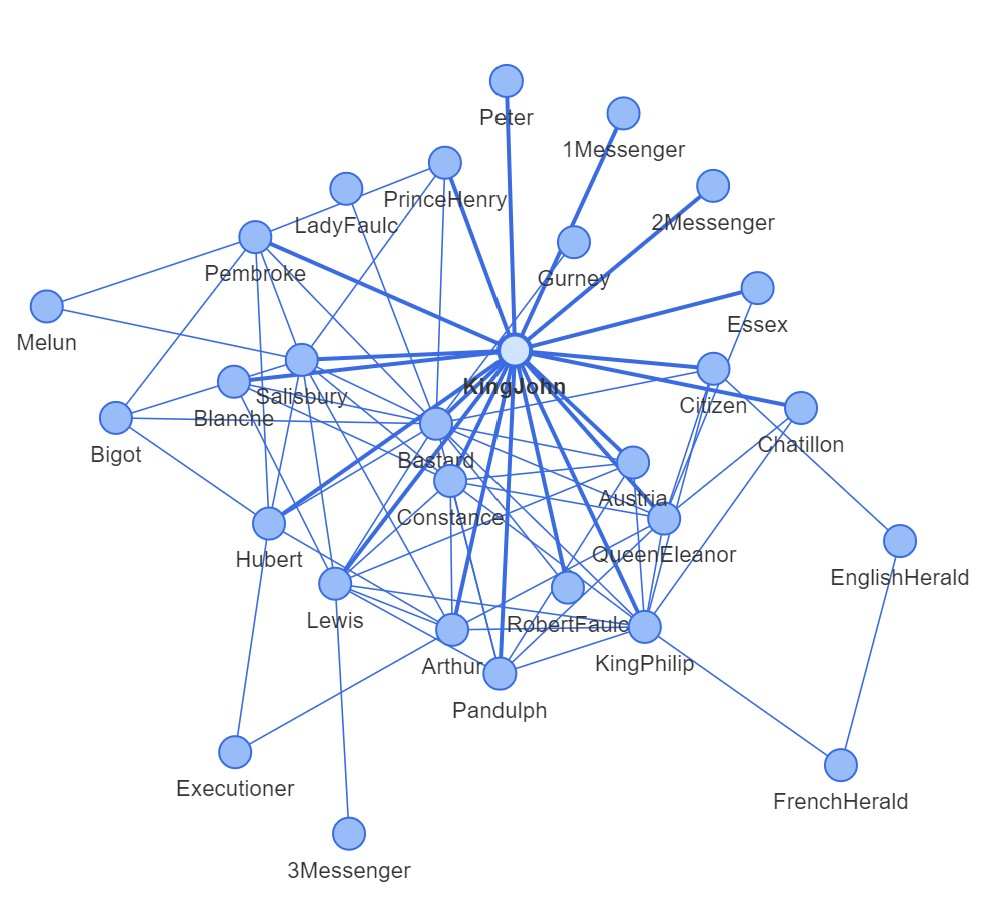

# Assignment 3 - Transfer learning + CNN classification
[GITHUB LINK](https://github.com/Rysias/cds-assignments/tree/main/language-assignments/language-a3)

# TODO

## Table of Content
- [Assignment Description](#assignment-description)
    * [Personal learning goals](#personal-learning-goals)
- [Methods and design](#methods-and-design)
    * [Software design](#software-design)
- [Usage](#usage)
    * [Setting up](#setting-up)
    * [Using the script(s)](#using-the-scripts)
- [Results and Discussion](#results-and-discussion)
    * [Results](#results)
    * [Discussion](#discussion)

## Assignment Description
In this assignment, you are going to write a ```.py``` script which can be used for network analysis. As we saw last week, pretty much anything can be formalised as a network. We're not going to focus on creating the edgelists for this project; instead, the goal is to have a script that would work the same way on _any_ input data, as long as the input format is correct. 

Your script should do the following:

- If the user enters a _single filename_ as an argument on the command line:
  - Load that edgelist
  - Perform network analysis using ```networkx```
  - Save a simple visualisation
  - Save a CSV which shows the following for every node:
    - name; degree; betweenness centrality; eigenvector_centrality
- If the user enters a _directory name_ as an argument on the command line:
  - Do all of the above steps for every edgelist in the directory
  - Save a separate visualisation and CSV for each file


### Personal Learning Goals 
# TODO


## Methods and Design
# TODO 

### Software Design
# TODO 
- **Single responsibility**:
- **Open-closed**: 
- **Liskov substitution**: 
- **Interface segregation**: 
- **Dependency Inversion**: 

## Usage 
TL;DR: An example of the entire setup and running the pipeline can be run using the bash-script `run_project.sh`. 

### Setting up
The project uses [pipenv](https://pipenv-fork.readthedocs.io/en/latest/basics.html). Setup can be done as easily as `pipenv install` (after pipenv has been installed) and activating the environment is `pipenv shell`. NB: Make sure that you have python 3.9 (or later) installed on your system!

### Using the script
# TODO
As with the other assignments, the script is documented using [argparse](https://docs.python.org/3/library/argparse.html). Full documentation can therefore be found by using the `--help`-flag, i.e. `python network_analysis.py --help`. Running this gives the following output 

```console
usage: network_analysis.py [-h] --data-path DATA_PATH

Does rudimentary network analysis on a file or folder. The files must be tsv files with the following
columns: 'Source', 'Target', 'Weight'

optional arguments:
  -h, --help            show this help message and exit
  --data-path DATA_PATH
                        Path to either the directory or a specific tsv file
``` 

#### Example usage

```console
$ python network_analysis.py --data-path input/network_file.csv
```
## Discussion and Results


# TODO 