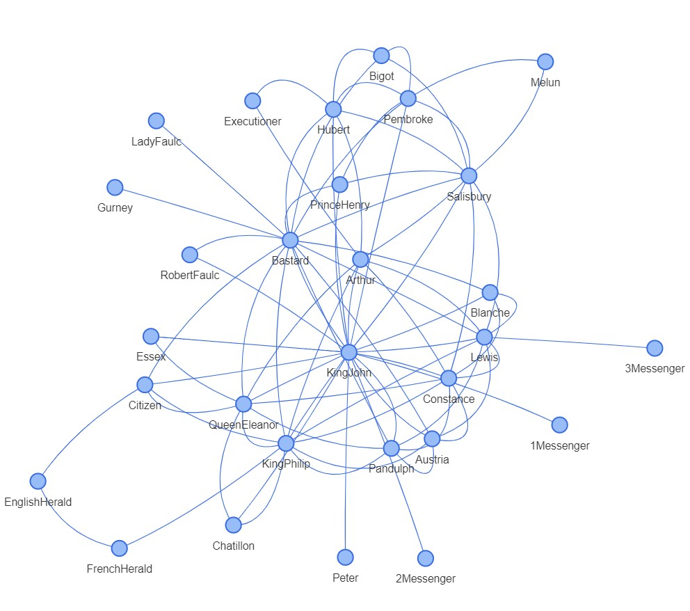

# Assignment 3 - Transfer learning + CNN classification
[GITHUB LINK](https://github.com/Rysias/cds-assignments/tree/main/language-assignments/language-a3)

# TODO

## Table of Content
- [Assignment Description](#assignment-description)
    * [Personal learning goals](#personal-learning-goals)
- [Methods and design](#methods-and-design)
    * [Software design](#software-design)
- [Usage](#usage)
    * [Setting up](#setting-up)
    * [Using the script(s)](#using-the-scripts)
- [Results and Discussion](#results-and-discussion)
    * [Results](#results)
    * [Discussion](#discussion)

## Assignment Description
In this assignment, you are going to write a ```.py``` script which can be used for network analysis. As we saw last week, pretty much anything can be formalised as a network. We're not going to focus on creating the edgelists for this project; instead, the goal is to have a script that would work the same way on _any_ input data, as long as the input format is correct. 

Your script should do the following:

- If the user enters a _single filename_ as an argument on the command line:
  - Load that edgelist
  - Perform network analysis using ```networkx```
  - Save a simple visualisation
  - Save a CSV which shows the following for every node:
    - name; degree; betweenness centrality; eigenvector_centrality
- If the user enters a _directory name_ as an argument on the command line:
  - Do all of the above steps for every edgelist in the directory
  - Save a separate visualisation and CSV for each file


### Personal Learning Goals 
Apart from solving the extra tasks, which requires a scalable achitecture, I want to continue practicing [TDD](https://en.wikipedia.org/wiki/Test-driven_development) and the [SOLID principles](https://www.digitalocean.com/community/conceptual_articles/s-o-l-i-d-the-first-five-principles-of-object-oriented-design). 


## Methods and Design
### Metrics
This assignment relies on the [networkx-package](https://networkx.org/), which is the de-facto standard for network analysis in python. I the package to calculate the following three metrics: degree-centrality, (weighted) betweenness-centrality, and (weighted) eigenvector centrality. 

[Degree-centrality](https://networkx.org/documentation/stable/reference/algorithms/generated/networkx.algorithms.centrality.degree_centrality.html) is simply defined as the fraction of nodes a given node is connected to. It is thus one of the simplest network measures. 

[Betweenness-centrality](https://networkx.org/documentation/stable/reference/algorithms/generated/networkx.algorithms.centrality.betweenness_centrality.html) is sligthly more complicated (but not too much). It describes the fraction of [shortest paths](https://en.wikipedia.org/wiki/Shortest_path_problem) that goes through a given node. This makes betweenness a useful measure for finding "Super spreaders" or "connectors" in a network. The weighted version treats the weight as the distance between two nodes - a higher value thus means the pair is less well connected. 

Finally, [eigenvector-centrality](https://networkx.org/documentation/stable/reference/algorithms/generated/networkx.algorithms.centrality.eigenvector_centrality.html) is the most abstract of the measures. Colloquially, it computes centrality as a function of the "popularity" of a node's connections. This is calculated in an iterated fashion using the power method. 

### Visualisation
As networkx is primarily a graph analysis algorithm, the [developers recommend](https://networkx.org/documentation/stable/reference/drawing.html) using external libraries for visualisation. I therefore use the [pyvis-package](https://pyvis.readthedocs.io/en/latest/). 

Pyvis is a great library for interactive network visualisation. Interactive visualisations have the advantage of making it easier to explore networks as these can get [quite hairy with size](https://www.researchgate.net/profile/Henrique-Arruda/publication/332849164/figure/fig4/AS:759214012133383@1558022134731/Network-visualization-by-considering-ten-opinions.png). Interactivity does, however, have the disadvantage of being less portable compared to static visualisations. However, most modern software supports HTML (which is the output format of pyvis), so no cow on the ice. 

### Software Design

- **Single responsibility**:
- **Open-closed**: 
- **Liskov substitution**: 
- **Interface segregation**: 
- **Dependency Inversion**: 

## Usage 
TL;DR: An example of the entire setup and running the pipeline can be run using the bash-script `run_project.sh`. 

### Setting up
The project uses [pipenv](https://pipenv-fork.readthedocs.io/en/latest/basics.html). Setup can be done as easily as `pipenv install` (after pipenv has been installed) and activating the environment is `pipenv shell`. NB: Make sure that you have python 3.9 (or later) installed on your system!

### Using the script
As with the other assignments, the script is documented using [argparse](https://docs.python.org/3/library/argparse.html). Full documentation can therefore be found by using the `--help`-flag, i.e. `python network_analysis.py --help`. Running this gives the following output 

```console
usage: network_analysis.py [-h] --data-path DATA_PATH

Does rudimentary network analysis on a file or folder. The files must be tsv files with the following
columns: 'Source', 'Target', 'Weight'

optional arguments:
  -h, --help            show this help message and exit
  --data-path DATA_PATH
                        Path to either the directory or a specific tsv file
``` 

#### Example usage

```console
$ python network_analysis.py --data-path input/network_file.csv
```
## Discussion and Results
To investigate whether we have successfully completed the task, we will investigate one the output of one of the input files, namely [`input/KJ.csv`] from Ross' data. First let's have a look at the visualisation.



Here we see that we have indeed produced a nice visualisation of all the different nodes. Note that the script (`network_analysis.py`) outputs .html-files so the above graph is a screenshot. 

From the graph it looks like "KingJohn" is the most central node and that "Bastard" is also a fairly central node. Let's see if the measures support this eyeballing:  

name|degree_centrality|betweenness_centrality|eigenvector_centrality
-- | -- | -- | --
KingJohn|0.7142857142857142|0.39263353489543973|0.415529124477519
Bastard|0.5714285714285714|0.2594293272864701|0.34941357298082104
KingPhilip|0.39285714285714285|0.09991496598639456|0.2941853584467601
Lewis|0.3571428571428571|0.08493008314436885|0.2829693654619046
Salisbury|0.3571428571428571|0.06857205845301084|0.25415735668860473

*Table 1: Measures for KJ*

Lo and behold! KingJohn is the most by quite a margin on all the metrics and Bastard is a clear second - especially on degree-centrality and betweenness-centrality. Betweenness-centrality in particular makes sense as they connect LadyFaulc and Gurlic to the hub that is KingJohn. 

What this sanity check ultimately shows us is that our tool works. And given the [SOLID design choices](#software-design), it might prove useful for many more projects to come!
