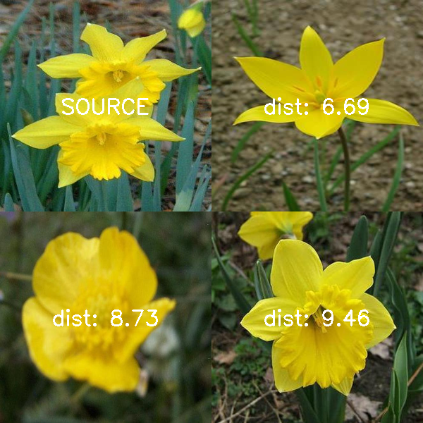

# Assignment 1: Most similar images
[GITHUB LINK](https://github.com/Rysias/cds-assignments/tree/main/vision-assignments/vision-a1)


## Table of Content
- [Assignment Description](#assignment-description)
- [Methods and design](#methods-and-design)
    * [Software design](#software-design)
- [Usage](#usage)
    * [Setting up](#setting-up)
    * [Using the script(s)](#using-the-scripts)
- [Discussion of the Results](#discussion-of-the-results)

## Assignment Description
For this assignment, you will write a small Python program to compare image histograms quantitively using Open-CV and the other image processing tools you've already encountered. Your script should do the following:

- Take a user-defined image from the folder
- Calculate the "distance" between the colour histogram of that image and all of the others.
- Find which 3 image are most "similar" to the target image.
- Save an image which shows the target image, the three most similar, and the calculated distance score.
- Save a CSV which has one column for the filename and three columns showing the filenames of the closest images in descending order
- (bonus task) Create a program which does this for the whole dataset, creating a CSV with one column showing the file name for each image and three other columns showing the most similar images

**Personal focus**

In this assignment, I want to focus on creating performant code. Finding most similar images is fairly expensive as it requires a) a lot of image processing, and b) N^2 comparisons. I will therefore experiment with how to parallelize the code and avoid unnecessary duplication of processing.
Furthermore, I want to be better at writing production-grade code that is easy to read and maintain. Therefore I will try to implement the SOLID-principles in this (and future) assignments.

## Methods and design
My algorithm for finding the most similar images for a given image goes as follows: 
1. *calculate color histograms of all images in directory*: This is the most expensive part. Calculating them all at once has several benefits: 
    1) it allows for multi-processing 
    2) the histograms require dramatically less memory than images which makes it possible to hold all results in memory. This further speeds up the calculations.
2. *find the 3 closest images*: Finding the three closest require a couple of steps: 
    1) create a dataframe of all comparisons with source image (`create_dist_df()`)
    2) find the n smallest using the build in `pandas` function `df.nsmallest()`
3. Create target output dataframe
4. Organise the top images in a square using some `opencv` magic
5. write images. 
A full breakdown can be seen in the `find_similar_imgs.py` script. 

calculating for the whole dir is basically the same. The only difference is some tricks to avoid double counting and more parallel processing as found in the `find_all_similarities()`-function. 


### Software Design
The SOLID-principles are a way of writing robust and scalable code. Below is a break-down of how each principle applies

- **Single responsibility**: Splitting functionality into separate files and functions. This makes it easier to know where to change functionality / refactor. For instance I have split [calculating distances](src/calculate_dists.py) and [formatting output](src/format_output.py) into two separate files. 
- **Interface segregation**: I make the main scripts independent of the implementation details in each other by relying on files in the [`src`-directory](src/). This makes it easier to clean
- **Liskov substitution**: Not super applicable to this concrete project as it is more functional than OOP
- **Open-closed**: This follows closely from single responsibility in this project
- **Dependency Inversion**: By using type hints, I make it relatively easy to create a new function for comparing distances (such as the ones explained in the [discussion](#discussion-of-the-results))

## Usage 
TL;DR: An example of the entire setup and running pipeline can be run using the bash-script [`run_project.sh`](./run_project.sh). 

### Setting up
The project uses [pipenv](https://pipenv-fork.readthedocs.io/en/latest/basics.html). Setup can be done as easily as `pipenv install` (after pipenv has been installed) and activating the environment is `pipenv shell`. NB: Make sure that you have python 3.9 (or later) installed on your system!

### Using the script(s)
The scripts are documented using [argparse](https://docs.python.org/3/library/argparse.html). Complete documentation can therefore be found using `<name of script>.py --help`. Below `find_similar_imgs.py` is illustrated:

Parameter | Type | Required | Description
---- | ---- | ---- | ----
`--img-name` | `str` | Yes | file name of the specified image
`--data-dir` | `str` | No |Path to directory for finding images and similar images (defaults to `input`)
`--ncores` | `int` | Yes |How many cores to use for multiprocessing (defaults to 1 less than total cpu)

Here is an example of using it with a very big machine
```console
$ python find_similar_imgs.py --img-name testimg.jpg --ncores 1000
```

## Discussion of the Results
There are two things to evaluate wrt results: The quality of the code and the (subjective) quality of the output. As I have previously discussed the code quality and performance, I will focus on the quality of the output. 

As humans are fairly good at pattern recognition, it is instructive to investigate the example output: 



At first glance the script is successful: all the images depict yellow flowers. At a closer look one notices small disrepencies. For instances the closest flower (top right corner) is a different species, while the third closest (bottom right) is the same. From our expert-ish botanist (or at least evolutionarily trained) perspective, the two should been reversed. 

Looking at it from a histogram-comparison perspective, the rankings make sense. The saturation and ligthing are quite similar on the top image compared to the same-species one that is much . This highlights a fundamental flaw with the technique: it has no conception of semantics. What we mean by "similar" is a relatively abstract thing such as structure of the petals or other more qualified botany-jargon. 

This doesn't mean that finding similar images is forever outside the reach of mere computers. Using sophisticated feature extraction (such as in [assignment 3](../vision-a3) with VGG16) one can capture more of the semantics. However, this comes with its own trade-offs which I will describe in due time. 

## Files
Below is a description of the different files.

### Helper files 
To cleanly separate functionality, I have created a `src` directory with the following files. This allows us to segregate the interfaces: 
- [`calculate_dists.py`](src/calculate_dists.py): functionality for doing all the heavy lifting and calculations
- [`format_output.py`](src/format_output.py): functionality for creating nice and readable outputs
- [`img_help.py`](src/img_help.py): functionality shared between the two main scripts.

### Scripts
1. [`find_similar_imgs.py`](./find_similar_imgs.py): a script for completing the basic task as described in `assignment1.md`. Takes a filename (the source image) as argument and, optionally, a directory and number of cores to use. Outputs an image with the 3 most similar images with their distances as well as a csv with similarities. 
2. [`dir_similarity.py`](./dir_similarity.py): Find closest 3 images for every image in the supplied directory.

### Other files
- [`experiments.ipynb`](./experiments.ipynb): code sketches and experiments
